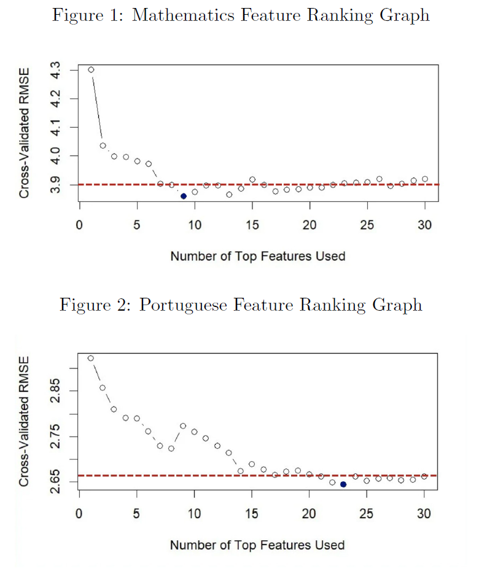

# Predicting Student Performance: A Replication and Extension  

This project is a comprehensive **replication and extension** of the 2008 paper by **P. Cortez and A. Silva**, *"Using Data Mining to Predict Secondary School Student Performance."*  

The analysis was conducted in **R** and is divided into two main phases:  
1. A faithful replication of the original study's results.  
2. An extension that implements a systematic **feature selection process** to build simpler, more powerful predictive models.

The full analysis and findings are detailed in the accompanying [Final Report](./Student-Performance-Project/Final_Report.pdf)

---

## Key Findings & Improvements  

The extension work, which focused on the most challenging real-world scenario (*Setup C*, where no prior grades are available), yielded significant improvements:  

- **Identified Core Predictors:** Using Random Forest-based feature ranking, an optimal subset of **9 core predictors** for the Mathematics dataset and **23 for the Portuguese dataset** was identified.
- **Improved Model Performance:** Models trained on these refined feature sets consistently performed better, including a **10% lower RMSE in regression** for the Random Forest and **5% increase in accuracy** for the SVM classifier on the 5-level Portuguese classification task.  
- **Enhanced Simplicity & Interpretability:** For Mathematics, the final model achieved comparable results with **70% fewer features** (9 vs. 30+), making it simpler and easier to interpret.  
- **Solved the Precision Problem:** The feature selection process significantly improved **Random Forest precision** on the binary classification task, producing a more reliable predictor.

#### Feature Selection Process:
To identify the optimal set of "core predictors," a Filter Method was implemented based on the feature importance metric from the randomForest package. The importance of each feature was calculated using the Percentage Increase in Mean Squared Error (%IncMSE). This method works by training a Random Forest and then, for each feature, randomly permuting its values in the out-of-bag (OOB) samples and measuring how much the model's prediction error (MSE) increases. A larger increase in error implies a more important feature.  

 ```R
# Train a Random Forest model on the Setup C data
rf_model <- randomForest(G3 ~ ., data = data_C, importance = TRUE)

# Extract importance scores (%IncMSE) and sort them
raw_importance <- importance(rf_model, type = 1)
sorted_importance <- sort(raw_importance[,1], decreasing = TRUE)

# Get the final ranked list of feature names
ranked_features <- names(sorted_importance)
```
#### Performance vs. Number of Features:
The graphs below plot the cross-validated RMSE against the number of top-ranked features used to train the model. This visualization allowed us to identify the "sweet spot" where the model's performance stabilized, indicating the optimal number of features to retain.  


---

## Data  

The two datasets used in this analysis (**student-mat.csv** and **student-por.csv**) were sourced from the [UCI Machine Learning Repository](https://archive.ics.uci.edu/ml/datasets/student+performance). They contain student grades, demographic, social, and school-related features.  

---
## Repository Structure  

- 📁 student-performance-project  
  - 📁 code  
    - 📄 [Replication - Binary Classification](./Student-Performance-Project/code/Replication%20Binary%20Classification.R)  
    - 📄 [Replication - 5-Level Classification](./Student-Performance-Project/code/Replication%20Binary%20Classification.R)
    - 📄 [Replication - Regression](./Student-Performance-Project/code/Replication%20Regression.R)
    - 📄 [Improvement and Variable selection - Regression (Mathematics)](./Student-Performance-Project/code/Improvement%20Regression%20and%20Variable%20selection%20-%20Mathematics.R)  
    - 📄 [Improvement and Variable selection - (Portuguese)](./Student-Performance-Project/code/Improvement%20Regression%20and%20Variable%20selection%20-%20Portuguese.R)  
    - 📄 [Improvement Binary Classification (Mathematics)](./Student-Performance-Project/code/Improvement%20Binary%20Classification%20-%20Mathematics.R)  
    - 📄 [Improvement Binary Classification - (Portuguese)](./Student-Performance-Project/code/Improvement%20Binary%20Classification%20-%20Portuguese.R)  
    - 📄 [Improvement 5 Level Classification - (Mathematics)](./Student-Performance-Project/code/Improvement%205%20Level%20Classficiation%20-%20Mathematics.R)  
    - 📄 [Improvement 5 Level Classification - (Portuguese)](./Student-Performance-Project/code/Improvement%205%20Level%20Classification%20-%20Portuguese.R)  
  - 📁 data  
    - 📄 [student-mat.csv](./Student-Performance-Project/data/student-mat.csv)  
    - 📄 [student-por.csv](./Student-Performance-Project/data/student-por.csv)  
---
## How to Run the Code  

### Prerequisites  

- **R**: Install a recent version (≥ 4.x).  
- **R Packages**: Install dependencies by running:
  
  ```R
  install.packages(c("rminer", "randomForest"))
  library(rminer)
  library(randomForest)
- ⚠ Note: Ensure that student-mat.csv and student-por.csv (from /data) are in the R working directory when running the scripts.
  
### Execution Order:  
- Replication Scripts: Run the replication scripts which reproduce the baseline results from the original paper.
- Variable Selection: Run [Improvement and Variable selection - Regression (Mathematics)](./Student-Performance-Project/code/Improvement%20Regression%20and%20Variable%20selection%20-%20Mathematics.R) and [Improvement and Variable selection- Portuguese.R](./Student-Performance-Project/code/Improvement%20Regression%20and%20Variable%20selection%20-%20Portuguese.R) which perform Random Forest-based feature ranking and search for optimal predictors within the Regression setup.
- Run and evaluate the final, improved models that take the optimal feature sets found in the previous step, for the binary and 5-Level Classification setup.
---

